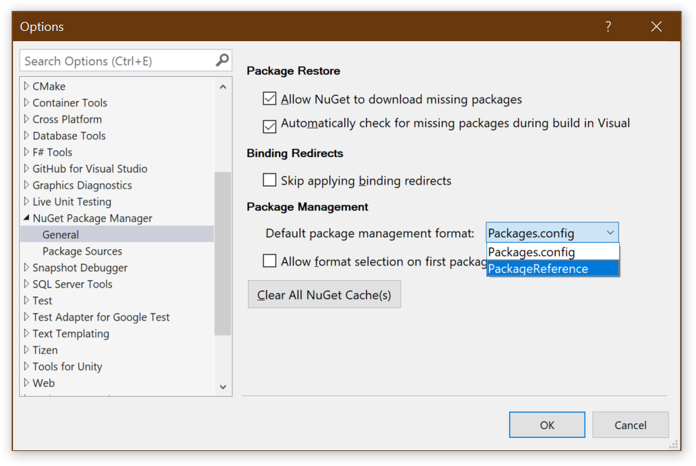
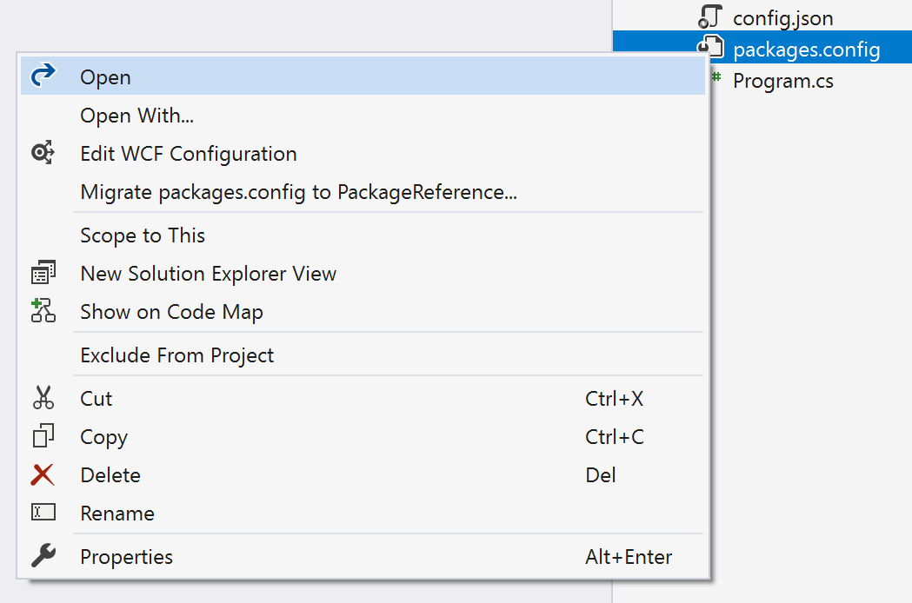
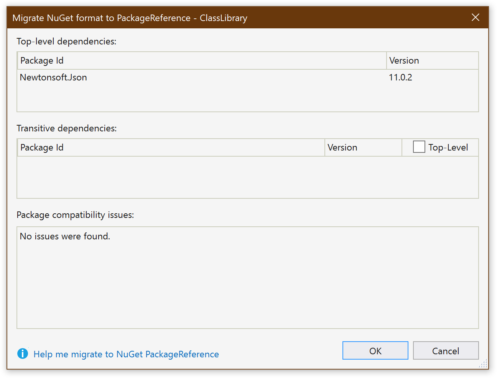

# Stage 2 - PackageReference

The first step in any upgrade to using anything new is to switch to
PackageReference instead of the old packages.config.

More information can be found on the Microsoft Docs site:

- [Package references (PackageReference) in project files](https://docs.microsoft.com/en-us/nuget/consume-packages/package-references-in-project-files)
- [Migrate from packages.config to PackageReference](https://docs.microsoft.com/en-us/nuget/reference/migrate-packages-config-to-package-reference)

This is very simple and is really just 2 related, but separate tasks. It
requires no code changes at all, just a small update to the .csproj:

## Changed the IDE Default

This is a very simple step, that merely sets the default for new projects:

1. Go to `Tools` | `Options...`
2. Select `NuGet Package Manager` | `General`
3. Under `Default package management format`, select `PackageReference`

**That is it!**

All new project will automatically use the new and improved PackageReference.
This is not tied to .NET Standard or .NET Core, it is pure MSBuild magic.

## Change the Project

This is also a very simple task.

1. Make sure the project builds
2. Right click each of the `packages.config` files
3. Select `Migrate packages.config to PackageReference...`
4. In the dialog that appears, select the packages that you would like to keep
   as top-level references

[<< Stage 1 - Initial](../Stage%201%20-%20Initial) | [Stage 3 - SDK-Style >>](../Stage%203%20-%20SDK-Style)
